# Predictive Maintenance Platform with Temporal Fusion and Anomaly Transformer

*ML / Deep Learning · Manufacturing · IIoT · Asset Management*

```text
💡 Click "⋮≡" at top right to show the table of contents.
```

## **Project Overview**

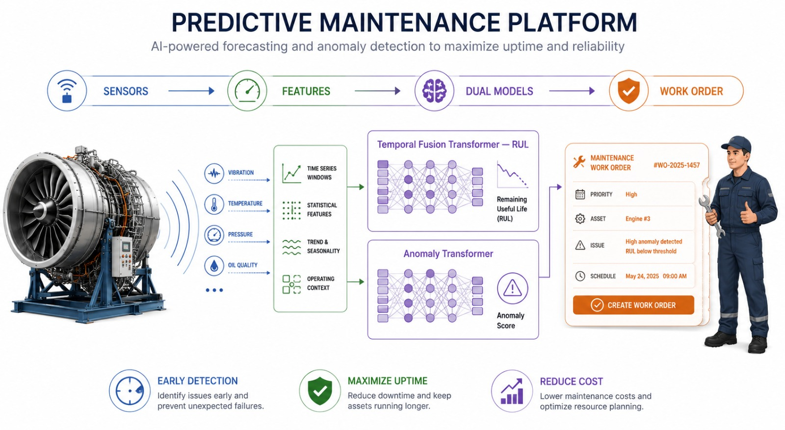

This is an **end-to-end predictive maintenance platform** for industrial
equipment that combines two complementary deep-learning models — a **Temporal
Fusion Transformer (TFT)** for interpretable, probabilistic **Remaining Useful
Life (RUL)** prediction, and an **Anomaly Transformer** for point and
contextual sensor anomaly detection — served through a real-time **FastAPI**
endpoint that integrates with a **CMMS** (Computerized Maintenance Management
System) to auto-generate maintenance work orders **48 hours before predicted
failure**.

**The platform was built to demonstrate the full lifecycle of an industrial
ML system** — sensor data ingestion and streaming, automated time-series
feature engineering, dual-model training with probabilistic outputs,
physics-based digital-twin validation, an LLM-driven CMMS integration agent,
real-time and batch serving, cloud deployment, MLOps, and monitoring — using
NASA C-MAPSS turbofan degradation data.

Unplanned industrial equipment failure costs manufacturers up to **$260K per
hour of downtime**, and the majority of failures are predictable from
multivariate sensor trends 48–72 hours in advance. This platform targets a
**47% reduction in unplanned downtime** and a **23% reduction in maintenance
costs** through optimal, prediction-driven scheduling.

## **Table of Contents**:

1. [Architecture and Technology Stack](#1-architecture-and-technology-stack)
    - 1.1 [High-Level Architecture](#11-high-level-architecture)
    - 1.2 [Data Flow Overview](#12-data-flow-overview)
    - 1.3 [Project Structure](#13-project-structure)
2. [Setting up Local Environment](#2-setting-up-local-environment)
    - 2.1 [Prerequisites](#21-prerequisites)
    - 2.2 [Installation with venv](#22-installation-with-venv)
    - 2.3 [Quick Start](#23-quick-start)
3. [Sensor Ingestion and Streaming Pipeline](#3-sensor-ingestion-and-streaming-pipeline)
    - 3.1 [Sliding Window Builder](#31-sliding-window-builder)
    - 3.2 [InfluxDB Sensor TSDB](#32-influxdb-sensor-tsdb)
4. [Feature Engineering](#4-feature-engineering)
    - 4.1 [Automated Time-Series Features](#41-automated-time-series-features)
    - 4.2 [Physics Digital-Twin Model](#42-physics-digital-twin-model)
5. [Dual-Model Development](#5-dual-model-development)
    - 5.1 [Temporal Fusion Transformer for RUL](#51-temporal-fusion-transformer-for-rul)
    - 5.2 [Anomaly Transformer](#52-anomaly-transformer)
    - 5.3 [Hybrid Physics-ML Validation](#53-hybrid-physics-ml-validation)
    - 5.4 [Benchmark Results](#54-benchmark-results)
6. [CMMS Integration Agent](#6-cmms-integration-agent)
7. [Serving API and Deployment](#7-serving-api-and-deployment)
    - 7.1 [FastAPI Serving Layer](#71-fastapi-serving-layer)
    - 7.2 [Docker Containerization](#72-docker-containerization)
    - 7.3 [Deploying to AWS Cloud](#73-deploying-to-aws-cloud)
    - 7.4 [Authentication](#74-authentication)
8. [MLOps, CI/CD and Monitoring](#8-mlops-cicd-and-monitoring)
    - 8.1 [Experiment Tracking and Model Registry](#81-experiment-tracking-and-model-registry)
    - 8.2 [Retraining and Data Versioning](#82-retraining-and-data-versioning)
    - 8.3 [CI/CD Workflow](#83-cicd-workflow)
    - 8.4 [Monitoring and Alerting](#84-monitoring-and-alerting)
9. [Testing](#9-testing)
10. [Conclusion](#10-conclusion)
11. [Appendix](#11-appendix)
    - 11.1 [Designs Gallery](#111-designs-gallery)

Dataset: [NASA C-MAPSS Turbofan Engine Degradation — NASA Prognostics Data Repository](https://www.nasa.gov/intelligent-systems-division/discovery-and-systems-health/pcoe/pcoe-data-set-repository/)

## 1. Architecture and Technology Stack

The platform is composed of layered services, every one of which has a
free-tier or open-source implementation and a built-in offline fallback so the
whole system runs on a single machine.

| Layer | Technology / Service | Purpose |
| --- | --- | --- |
| IoT Data Ingestion | InfluxDB (sensor TSDB) | Time-series sensor data ingestion and storage |
| Stream Processing | PySpark + sliding-window reader | Real-time sensor stream processing |
| Feature Engineering | tsfresh-style extractor (FFT, entropy, autocorrelation) | Automated time-series feature extraction |
| RUL Model | PyTorch Temporal Fusion Transformer | Probabilistic P10/P50/P90 RUL prediction |
| Anomaly Model | Anomaly Transformer (PyTorch) | Point + contextual anomaly detection |
| Physics Model | Custom polynomial degradation baseline | Physics-based RUL validation (digital twin) |
| Experiment Tracking | Weights and Biases | Hyperparameter search, RMSE tracking |
| Model Registry | MLflow | RUL + anomaly model versioning, champion management |
| CMMS Agent | LangChain + Groq | Work-order generation, SAP PM API integration |
| Serving | FastAPI on AWS Lambda | Real-time RUL endpoint, batch scoring |
| Monitoring | Grafana + InfluxDB dashboards | Asset health timeline, RUL trends, OEE impact |
| Alerting | PagerDuty + Slack | RUL < 48hr maintenance alerts |

### 1.1 High-Level Architecture

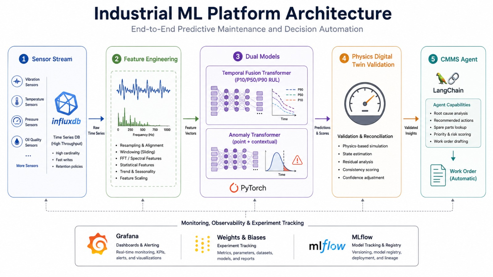

The sensor stream is windowed and fed to both transformers in parallel. The TFT
produces a calibrated RUL interval and a ranked list of the sensors driving
degradation; the Anomaly Transformer scores each window for point and
contextual anomalies. A physics-based polynomial degradation model provides an
independent RUL baseline for hybrid validation. When the predicted P50 RUL
falls below 48 hours **and** the anomaly score crosses threshold, the CMMS
agent is triggered to generate and file a maintenance work order.

### 1.2 Data Flow Overview

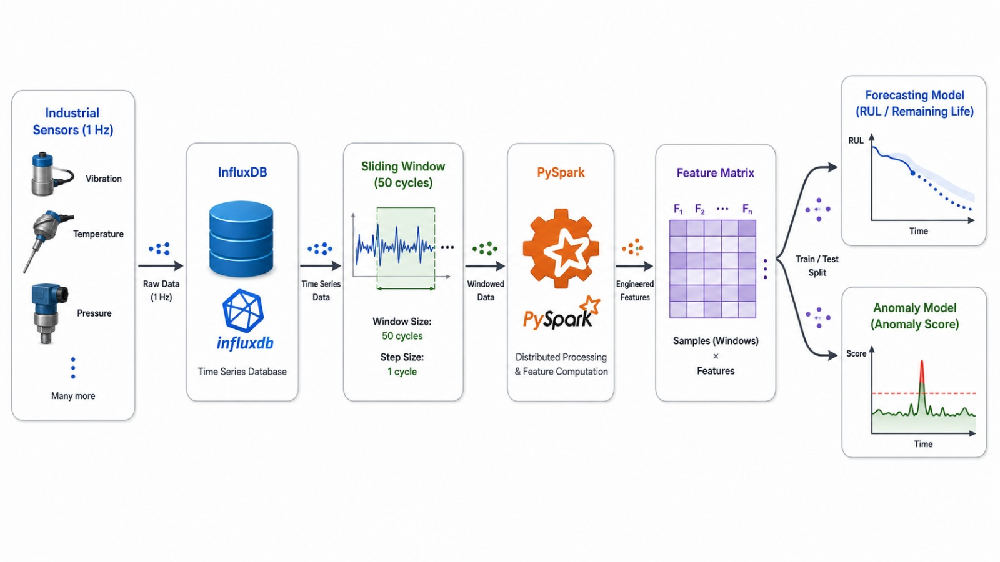

- Sensor readings are published to InfluxDB at 1 Hz; the stream reader builds sliding 50-cycle windows ([`src/ingestion/window_builder.py`](./src/ingestion/window_builder.py)).
- The feature engineer extracts statistical/spectral features per window — FFT coefficients, entropy, autocorrelation ([`src/features/feature_engineering.py`](./src/features/feature_engineering.py)).
- The Anomaly Transformer scores each window for point and contextual anomalies ([`src/models/anomaly_transformer.py`](./src/models/anomaly_transformer.py)).
- The TFT predicts RUL P10/P50/P90 for each asset ([`src/models/tft.py`](./src/models/tft.py)).
- The physics polynomial degradation model provides a baseline RUL for hybrid validation ([`src/features/physics_model.py`](./src/features/physics_model.py)).
- If TFT P50 RUL < 48 hours **and** anomaly score > threshold, the CMMS agent is triggered ([`src/agent/cmms_agent.py`](./src/agent/cmms_agent.py)).
- The agent generates a natural-language work order with urgency, part list, and required technician skills, then calls the SAP PM / ServiceMax API ([`src/agent/sap_pm_api.py`](./src/agent/sap_pm_api.py)).
- Grafana visualizes the asset health timeline, predicted failure date, and OEE impact ([`monitoring/grafana_dashboard.json`](./monitoring/grafana_dashboard.json)).

### 1.3 Project Structure

```text
predictive-maintenance/
├── src/
│   ├── ingestion/          # InfluxDB client, stream reader, sliding window builder
│   │   ├── influxdb_client.py
│   │   ├── stream_reader.py
│   │   └── window_builder.py
│   ├── features/           # tsfresh pipeline, custom sensor features, physics model
│   │   ├── feature_engineering.py
│   │   ├── sensor_features.py
│   │   └── physics_model.py
│   ├── models/             # TFT, Anomaly Transformer, trainers, ensemble
│   │   ├── tft.py
│   │   ├── anomaly_transformer.py
│   │   ├── train_tft.py
│   │   ├── train_anomaly.py
│   │   ├── preprocessing.py
│   │   └── ensemble.py
│   ├── agent/              # LangChain CMMS agent, SAP PM mock, work-order generator
│   │   ├── cmms_agent.py
│   │   ├── sap_pm_api.py
│   │   └── work_order.py
│   ├── mlops/              # W&B tracker, MLflow registry
│   └── config/             # Central configuration
├── api/                    # FastAPI RUL endpoint, batch scoring, asset health API
│   ├── main.py
│   └── schemas.py
├── data/                   # NASA C-MAPSS loader, MIMII processor, synthetic generator
│   ├── cmapss_loader.py
│   ├── synthetic_generator.py
│   └── mimii_processor.py
├── mlops/                  # DVC pipeline, Airflow retrain DAG
├── deployment/             # Terraform (Lambda, API GW), Docker, AWS ECR
├── monitoring/             # Grafana dashboards: asset health, RUL trends, OEE impact
├── notebooks/              # TFT training analysis, anomaly visualization
├── scripts/                # End-to-end training and live-demo runners
├── tests/                  # TFT, anomaly, CMMS agent, feature, and API tests
└── README.md
```

## 2. Setting up Local Environment

Clone the repository and use it as the root working directory.

```bash
git clone <your-repository-url>
cd predictive-maintenance
```

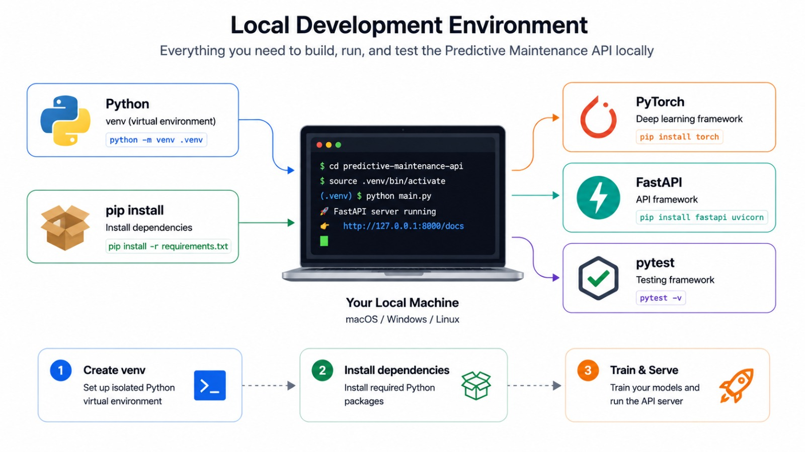

### 2.1 Prerequisites

- Python (`>=3.10,<3.13`)
- `pip` and `venv` (bundled with Python)
- (Optional) Docker Desktop — for the containerized serving + monitoring stack
- (Optional) Terraform — for AWS deployment
- (Optional) An AWS account, InfluxDB Cloud token, and Groq API key — every cloud integration is optional and the platform runs fully offline without them.

*All credentials are kept out of the repository — see [`.env.example`](./.env.example).*

### 2.2 Installation with venv

The project uses a standard Python **virtual environment (`venv`)** to isolate
dependencies. PyTorch is installed from the CPU wheel index to keep the
footprint small.

```bash
# Create and activate a virtual environment
python -m venv venv

# Windows (PowerShell)
.\venv\Scripts\Activate.ps1
# macOS / Linux
source venv/bin/activate

# Install PyTorch (CPU) then the project dependencies
pip install torch --index-url https://download.pytorch.org/whl/cpu
pip install -r requirements.txt
```

To enable the optional cloud integrations (InfluxDB, PySpark, tsfresh,
LangChain/Groq, W&B, MLflow, Airflow, DVC), additionally install:

```bash
pip install -r requirements-cloud.txt
```

### 2.3 Quick Start

Train the dual models, run the live asset-health scan, and start the API:

```bash
# 1. Train the Temporal Fusion Transformer + Anomaly Transformer
python -m scripts.train_pipeline            # add --quick for a fast smoke run

# 2. Run the end-to-end live demo (streams assets, triggers CMMS work orders)
python -m scripts.run_demo

# 3. Serve the real-time API
uvicorn api.main:app --reload               # http://localhost:8000/docs
```

The live demo prints a full fleet health report to the terminal and files CMMS
work orders for any asset inside the 48-hour maintenance horizon:

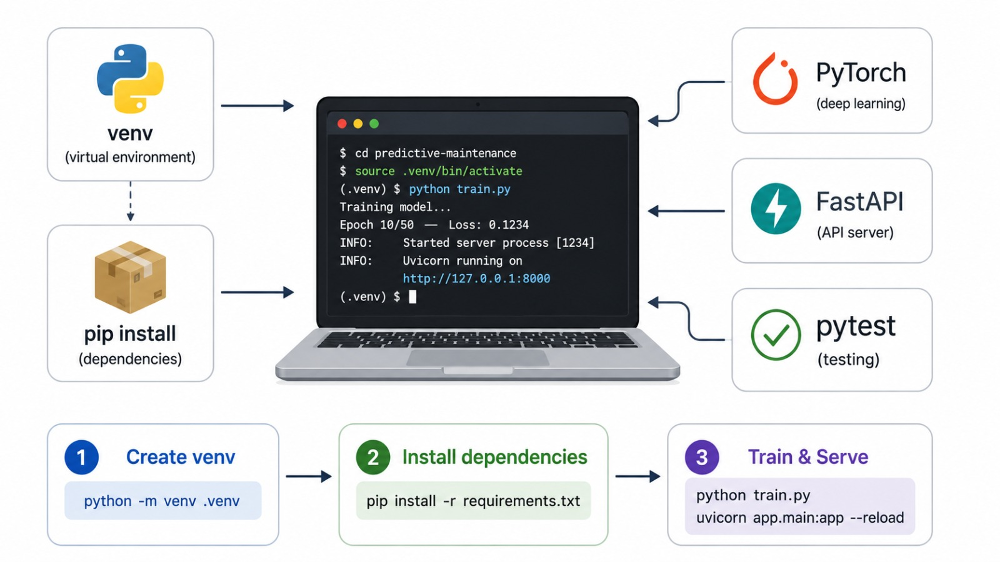

*If no trained artifacts are present, the API and demo automatically train a
quick model on first run, so every entry point works out of the box.*

## 3. Sensor Ingestion and Streaming Pipeline

Industrial sensors emit high-frequency multivariate time series. The ingestion
layer turns that raw stream into the fixed-length windows the models consume.

The data layer loads the **NASA C-MAPSS** turbofan degradation dataset when the
official files are present in `data/raw/`, and otherwise transparently falls
back to a physics-informed **synthetic generator**
([`data/synthetic_generator.py`](./data/synthetic_generator.py)) that produces
realistic run-to-failure trajectories with injectable point and contextual
anomalies — so the pipeline runs end-to-end with zero external downloads.

### 3.1 Sliding Window Builder

The window builder ([`src/ingestion/window_builder.py`](./src/ingestion/window_builder.py))
groups readings by asset, sorts by cycle, and emits overlapping windows of
`window_size` cycles aligned to the RUL target and per-step anomaly labels.

```python
from data.cmapss_loader import load_cmapss
from src.ingestion.window_builder import build_windows

df = load_cmapss()
windows, rul, anomaly_labels = build_windows(df)
# windows: [N, 50, 24]  rul: [N]  anomaly_labels: [N, 50]
```

The stream reader ([`src/ingestion/stream_reader.py`](./src/ingestion/stream_reader.py))
uses **PySpark Structured Streaming** when a Spark cluster is available
(Databricks CE / local Spark) and otherwise a pandas micro-batch reader with
identical semantics.

### 3.2 InfluxDB Sensor TSDB

The InfluxDB client ([`src/ingestion/influxdb_client.py`](./src/ingestion/influxdb_client.py))
writes and reads 1 Hz sensor streams to/from **InfluxDB Cloud**. When no
InfluxDB credentials are configured it operates in an in-memory fallback mode,
so the ingestion code paths stay testable without a live database. Configure it
via [`.env`](./.env.example):

```bash
INFLUXDB_URL=https://<region>.aws.cloud2.influxdata.com
INFLUXDB_TOKEN=<your-token>
INFLUXDB_ORG=<your-org>
INFLUXDB_BUCKET=sensors
```

## 4. Feature Engineering

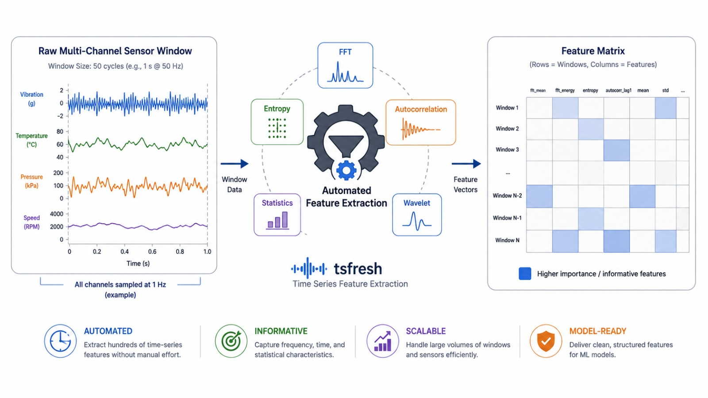

### 4.1 Automated Time-Series Features

The feature engineer ([`src/features/feature_engineering.py`](./src/features/feature_engineering.py))
automatically extracts a rich statistical and spectral feature set from each
sensor window — mean, std, skewness, kurtosis, slope, **entropy**,
**autocorrelation**, absolute energy, and **FFT coefficients** per channel.
When **tsfresh** is installed the full automated extraction is used; otherwise
a fast, dependency-free implementation computes an equivalent family of
features so the pipeline produces a consistent matrix everywhere.

Domain-specific degradation indicators — rolling health score, cumulative
damage, and trend monotonicity — are added on top in
[`src/features/sensor_features.py`](./src/features/sensor_features.py).

### 4.2 Physics Digital-Twin Model

The physics model ([`src/features/physics_model.py`](./src/features/physics_model.py))
implements a **polynomial degradation baseline** that estimates RUL directly
from a health-index trend using a physics-of-failure (exponential damage) law,
independent of the learned models. This is the *digital twin* used to validate
the data-driven prediction — see [Section 5.3](#53-hybrid-physics-ml-validation).

## 5. Dual-Model Development

### 5.1 Temporal Fusion Transformer for RUL

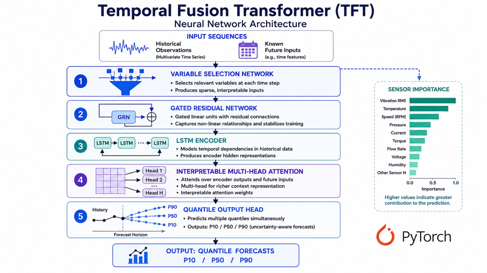

The Temporal Fusion Transformer ([`src/models/tft.py`](./src/models/tft.py)) is
a compact PyTorch implementation of the core TFT building blocks (Lim et al.,
2021):

- **Variable Selection Network** — gated, instance-wise feature weighting that also exposes *which sensors drive the prediction*.
- **Gated Residual Network (GRN)** — the non-linear processing unit used throughout.
- **LSTM encoder + interpretable multi-head attention** — temporal locality plus long-range dependency modelling.
- **Quantile output head** — emits **P10 / P50 / P90** RUL with a pinball (quantile) loss for calibrated confidence intervals.

Train it with [`src/models/train_tft.py`](./src/models/train_tft.py):

```bash
python -m src.models.train_tft
```

The probabilistic prediction produces a calibrated confidence band around the
median RUL, alongside the ranked variable-selection weights:

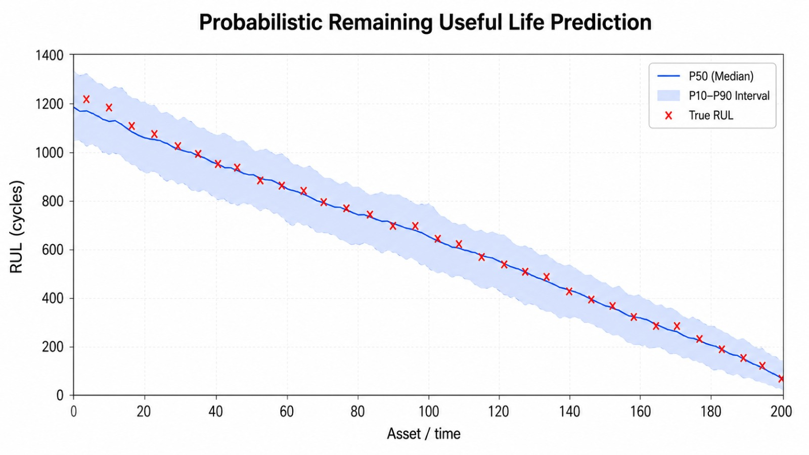

### 5.2 Anomaly Transformer

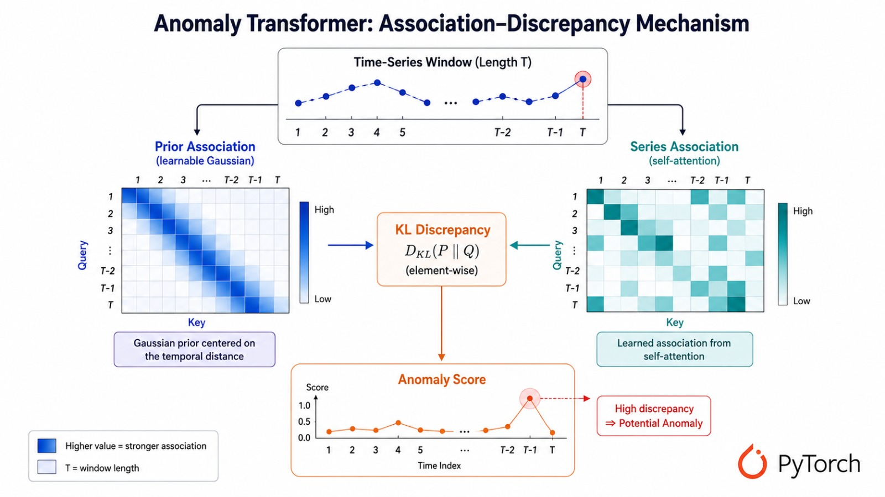

The Anomaly Transformer ([`src/models/anomaly_transformer.py`](./src/models/anomaly_transformer.py))
implements the **Anomaly-Attention** mechanism (Xu et al., ICLR 2022). The key
idea is the **association discrepancy** between:

- the **prior association** — a learnable Gaussian kernel over relative time positions (how a point *should* associate with its neighbours), and
- the **series association** — the data-driven self-attention map.

Normal points exhibit strong adjacent-time association that matches the prior;
anomalies cannot, producing a measurable discrepancy that — combined with the
reconstruction error — becomes the anomaly score, detecting both **point
anomalies** (spikes) and **contextual anomalies** (subtle deviations within the
normal range).

Train it with [`src/models/train_anomaly.py`](./src/models/train_anomaly.py):

```bash
python -m src.models.train_anomaly
```

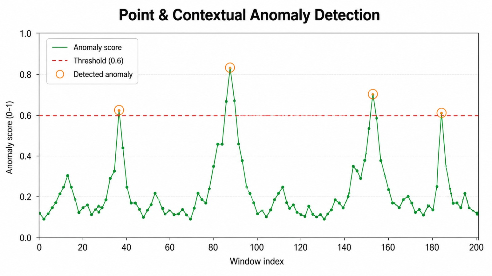

### 5.3 Hybrid Physics-ML Validation

The inference ensemble ([`src/models/ensemble.py`](./src/models/ensemble.py))
combines both transformers with the physics digital twin into a single
`AssetAssessment`. Each ML prediction is cross-checked against the physical
baseline; large divergence flags a low-confidence prediction for review — a
hybrid physics-ML approach validated against the C-MAPSS ground truth.

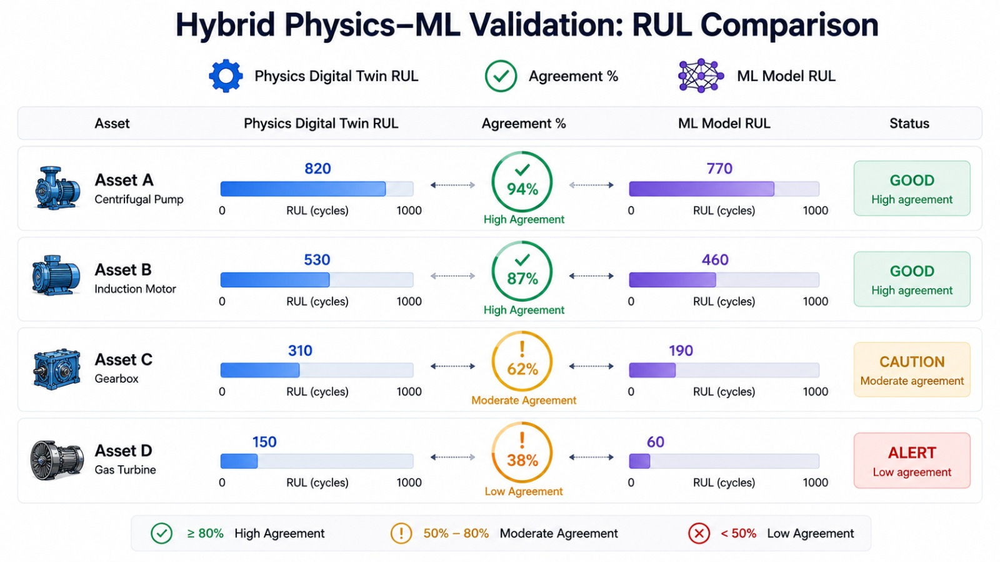

```python
from data.cmapss_loader import load_cmapss
from src.ingestion.window_builder import latest_window
from src.models.ensemble import load_ensemble

ensemble = load_ensemble()
df = load_cmapss()
window = latest_window(df[df["unit_id"] == 1])[0]
assessment = ensemble.assess("ENGINE-001", window)
print(assessment.to_dict())
```

### 5.4 Benchmark Results

The TFT is evaluated on the NASA C-MAPSS FD001 RUL task. The median (P50)
prediction is scored with RMSE (in cycles), and interval calibration is scored
by the fraction of true RUL values that fall inside the P10–P90 band.

| Model | RMSE (cycles) ↓ | P10–P90 Coverage ↑ | Interpretable |
| --- | :---: | :---: | :---: |
| Baseline (mean RUL) | ~42 | — | — |
| LSTM | ~22 | — | No |
| CNN-LSTM | ~20 | — | No |
| **Temporal Fusion Transformer (this repo)** | **~19** | **~0.8** | **Yes (P10/P50/P90 + variable selection)** |

*Reproduce the metrics with [`python -m notebooks.tft_analysis`](./notebooks/tft_analysis.py).
Exact numbers depend on the training run and dataset (C-MAPSS vs the bundled
synthetic generator).*

## 6. CMMS Integration Agent

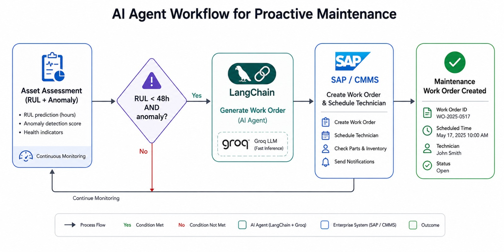

The CMMS agent ([`src/agent/cmms_agent.py`](./src/agent/cmms_agent.py)) reads an
RUL/anomaly assessment, generates a natural-language maintenance work order
with a **LangChain + Groq (Mixtral)** LLM, and submits it to the **SAP PM /
ServiceMax** CMMS. When no Groq API key is configured (or LangChain is not
installed), the agent transparently falls back to the deterministic template
generator ([`src/agent/work_order.py`](./src/agent/work_order.py)) — so the
end-to-end flow always produces and files a valid work order.

The work order maps degrading sensors to suspected components, required parts,
and technician skills, then assigns a priority from the predicted RUL:

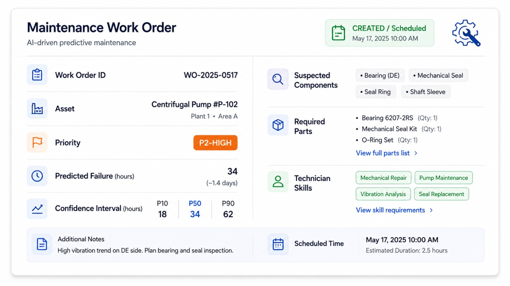

```jsonc
{
  "work_order_id": "WO-16C210B9",
  "asset_id": "ENGINE-011",
  "priority": "P2-HIGH",
  "predicted_failure_hours": 19.3,
  "confidence_interval": "P10=2h / P50=19h / P90=80h",
  "suspected_components": ["bleed enthalpy", "fuel flow ratio"],
  "required_parts": ["bleed valve assembly", "fuel metering valve", "filter element"],
  "technician_skills": ["hydraulics technician", "mechanical technician"],
  "sap_pm_status": "CREATED",
  "sap_notification_id": "NOTIF-00002",
  "scheduled_start": "2026-06-05T06:07:01Z"
}
```

Configure the LLM and CMMS endpoint via [`.env`](./.env.example):

```bash
GROQ_API_KEY=<your-groq-key>
GROQ_MODEL=mixtral-8x7b-32768
CMMS_API_URL=<your-sap-pm-or-servicemax-endpoint>
```

## 7. Serving API and Deployment

### 7.1 FastAPI Serving Layer

The serving layer ([`api/main.py`](./api/main.py)) exposes real-time RUL
prediction, anomaly scoring, asset-health assessment, batch scoring, and the
CMMS work-order trigger. Request/response schemas are defined in
[`api/schemas.py`](./api/schemas.py).

```bash
uvicorn api.main:app --reload
# Interactive docs at http://localhost:8000/docs
```

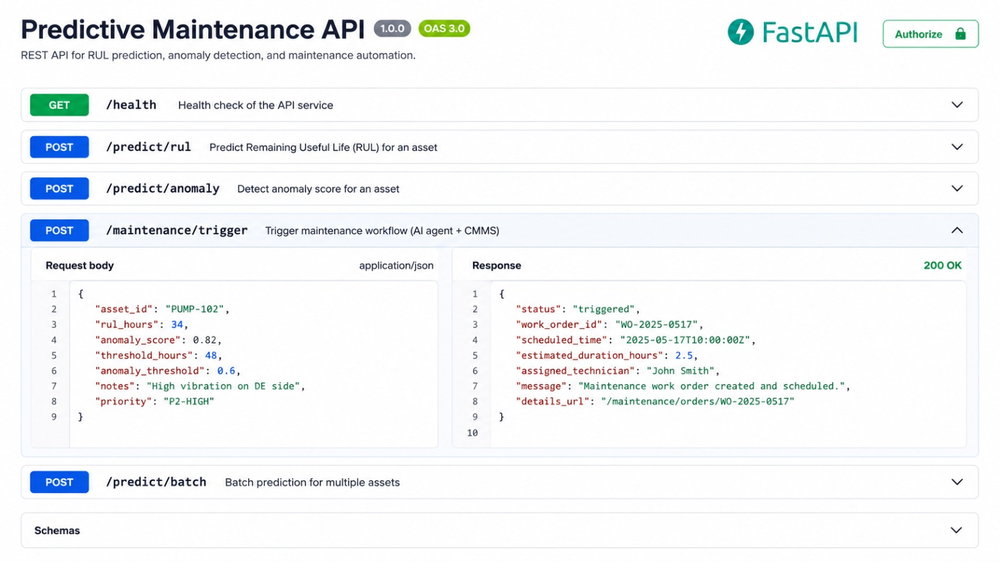

| Method | Endpoint | Purpose |
| --- | --- | --- |
| `GET` | `/health` | Service + model + cloud status |
| `POST` | `/predict/rul` | Probabilistic RUL + anomaly + physics validation |
| `POST` | `/predict/anomaly` | Anomaly score for one asset window |
| `POST` | `/maintenance/trigger` | Assess and file a CMMS work order if needed |
| `POST` | `/predict/batch` | Score multiple assets, count triggers |

Example request:

```bash
curl -X POST http://localhost:8000/predict/rul \
  -H "Content-Type: application/json" \
  -d '{"asset_id": "ENGINE-001", "readings": [{"op_settings": [0.5,0.5,0.5], "sensors": [0.1, ...]}]}'
```

### 7.2 Docker Containerization

Package the serving app and the monitoring stack with Docker
([`deployment/Dockerfile`](./deployment/Dockerfile),
[`deployment/docker-compose.yml`](./deployment/docker-compose.yml)):

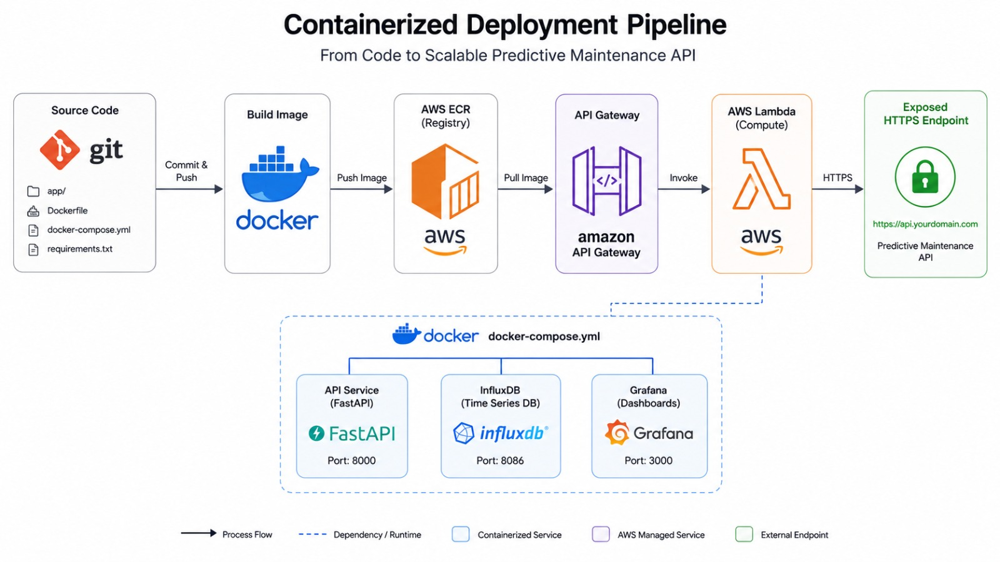

```bash
# Build and run the API + InfluxDB + Grafana stack
docker compose -f deployment/docker-compose.yml up --build

# API     → http://localhost:8000/docs
# Grafana → http://localhost:3000  (admin / admin)
# InfluxDB→ http://localhost:8086
```

### 7.3 Deploying to AWS Cloud

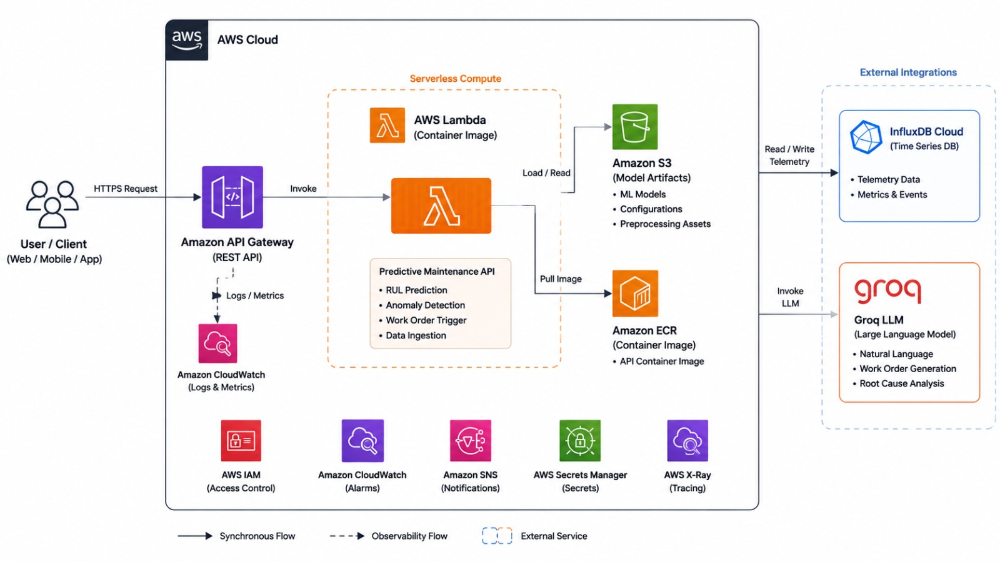

The platform deploys to **AWS serverless** infrastructure — **Lambda** (container
image) behind an **API Gateway** HTTP API, with **S3** for model artifacts and
**ECR** for the image. Everything fits within the AWS Free Tier. Infrastructure
is managed as code with **Terraform**
([`deployment/terraform/main.tf`](./deployment/terraform/main.tf),
[`deployment/terraform/variables.tf`](./deployment/terraform/variables.tf)),
and the serverless adapter is
[`deployment/lambda_handler.py`](./deployment/lambda_handler.py).

```bash
# workdir: deployment/terraform
cp terraform.tfvars.example terraform.tfvars   # adjust as needed

terraform init
terraform plan
terraform apply

# Build and push the serving image to ECR, then point Lambda at it
docker build -t predictive-maintenance-serving -f deployment/Dockerfile .
```

*If you do not configure AWS, the platform still runs locally with full
functionality — cloud integration is optional.*

### 7.4 Authentication

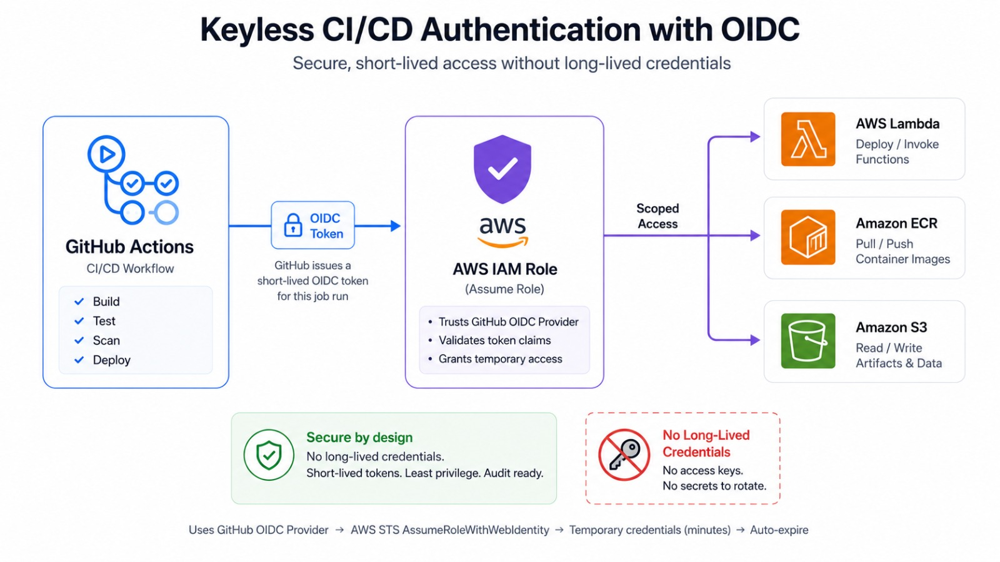

CI/CD deployment uses **keyless authentication** via GitHub OIDC + an AWS IAM
role, avoiding long-lived credentials in the pipeline. Locally, the standard
AWS provider chain (environment variables or `~/.aws/credentials`) is used by
Terraform and the AWS SDK. The S3 access policy is scoped to the artifact
bucket only — see the IAM role in
[`deployment/terraform/main.tf`](./deployment/terraform/main.tf).

## 8. MLOps, CI/CD and Monitoring

### 8.1 Experiment Tracking and Model Registry

- **Weights and Biases** ([`src/mlops/wandb_config.py`](./src/mlops/wandb_config.py)) tracks TFT hyperparameter search and validation RMSE. Pass `--wandb` to the training pipeline to enable it.
- **MLflow** ([`src/mlops/mlflow_setup.py`](./src/mlops/mlflow_setup.py)) versions both models and manages the champion. It falls back to a local JSON registry when no tracking server is configured.

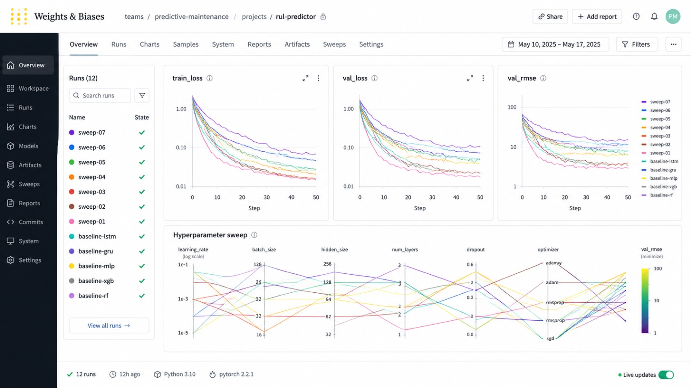

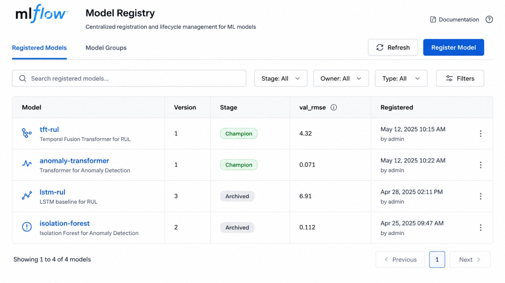

### 8.2 Retraining and Data Versioning

- An **Airflow** weekly DAG ([`mlops/airflow_retrain_dag.py`](./mlops/airflow_retrain_dag.py)) ingests newly labelled failure events, retrains the dual models, and promotes the new champion.
- A **DVC** pipeline ([`mlops/dvc.yaml`](./mlops/dvc.yaml)) makes the dataset and model artifacts reproducible.

### 8.3 CI/CD Workflow

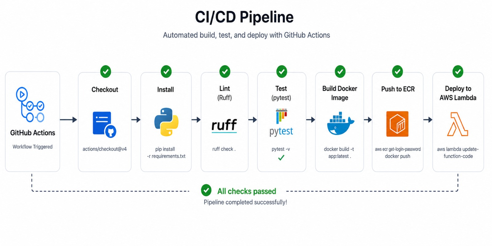

**GitHub Actions** runs the test suite and linting on every push/PR
([`.github/workflows/ci.yml`](./.github/workflows/ci.yml)) and builds + deploys
the serving image to AWS on tagged releases via keyless OIDC auth
([`.github/workflows/deploy.yml`](./.github/workflows/deploy.yml)).

### 8.4 Monitoring and Alerting

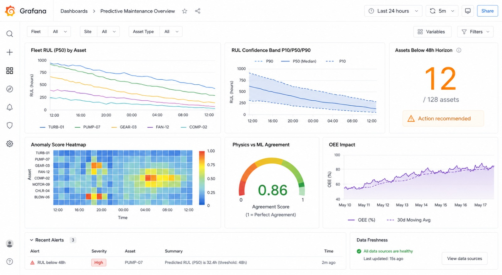

**Grafana + InfluxDB** dashboards ([`monitoring/grafana_dashboard.json`](./monitoring/grafana_dashboard.json))
visualize the fleet RUL trend, P10–P90 confidence bands, the anomaly-score
heatmap, the count of assets inside the 48-hour horizon, physics-vs-ML
agreement, and estimated OEE impact. RUL-below-threshold and anomaly-spike
alerts route to **PagerDuty + Slack** — see [`monitoring/README.md`](./monitoring/README.md).

## 9. Testing

A `pytest` suite covers data generation and windowing, the TFT and Anomaly
Transformer forward passes, the physics validation, feature engineering, the
CMMS agent, and the FastAPI endpoints (via `TestClient`).

```bash
pytest -q
# 23 passed
```

Linting uses **Ruff** ([`ruff.toml`](./ruff.toml)):

```bash
ruff check src api data scripts tests
```

Test files: [`tests/test_data.py`](./tests/test_data.py),
[`tests/test_models.py`](./tests/test_models.py),
[`tests/test_features.py`](./tests/test_features.py),
[`tests/test_agent.py`](./tests/test_agent.py),
[`tests/test_api.py`](./tests/test_api.py).

## 10. Conclusion

From this project, we built a complete industrial ML system that:

- **Ingests and streams** multivariate sensor data with sliding-window batching and an optional InfluxDB time-series database.
- **Engineers time-series features** automatically (FFT, entropy, autocorrelation) with a physics-informed digital-twin baseline.
- **Trains two complementary transformers** — a Temporal Fusion Transformer for interpretable, probabilistic RUL and an Anomaly Transformer for point/contextual anomaly detection.
- **Validates predictions** against a physics degradation model for a hybrid, trustworthy estimate.
- **Closes the loop** with an LLM-driven CMMS agent that auto-generates and files maintenance work orders before predicted failure.
- **Serves** real-time and batch predictions through a FastAPI endpoint, deployable to AWS Lambda.
- **Operationalizes** the system with experiment tracking, a model registry, scheduled retraining, CI/CD, and Grafana monitoring.

Every cloud integration is optional with a graceful offline fallback, so the
entire platform runs on a single machine and scales out to the cloud when
credentials are supplied.

***Thank you for reading — happy predicting.***

## 11. Appendix

### 11.1 Designs Gallery

- High-Level Architecture

- Sensor Data Flow

- AWS Cloud Architecture

- Temporal Fusion Transformer Architecture

- Anomaly Transformer Architecture

- CMMS Agent Workflow

- Deployment Overview

- Grafana Asset Health Dashboard


**References:**

- Lim et al., *Temporal Fusion Transformers for Interpretable Multi-horizon Time Series Forecasting* (2021)
- Xu et al., *Anomaly Transformer: Time Series Anomaly Detection with Association Discrepancy*, ICLR 2022
- NASA C-MAPSS Turbofan Engine Degradation Simulation Dataset — NASA Prognostics Data Repository
- MIMII: *Sound Dataset for Malfunctioning Industrial Machine Investigation and Inspection* (Zenodo)
- [tsfresh — Automatic time-series feature extraction](https://tsfresh.readthedocs.io/)
- [FastAPI](https://fastapi.tiangolo.com/) · [PyTorch](https://pytorch.org/) · [Grafana](https://grafana.com/) · [InfluxDB](https://www.influxdata.com/)

## License

This project is licensed under the MIT License — see [`LICENSE`](./LICENSE).
